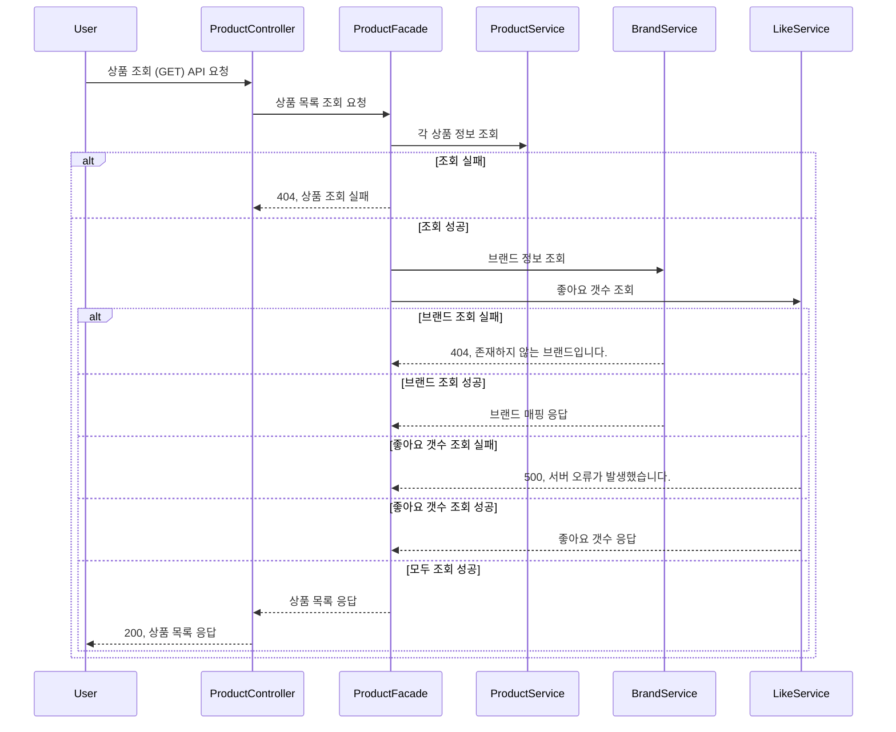
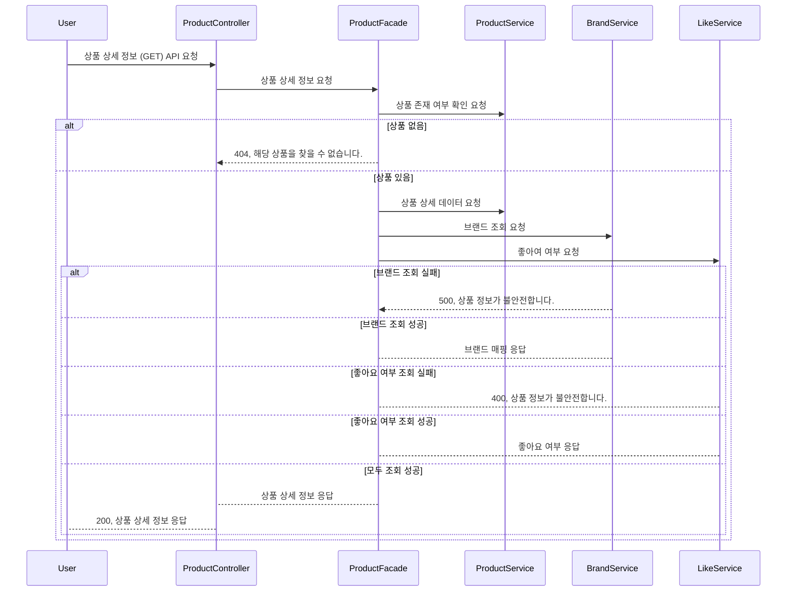
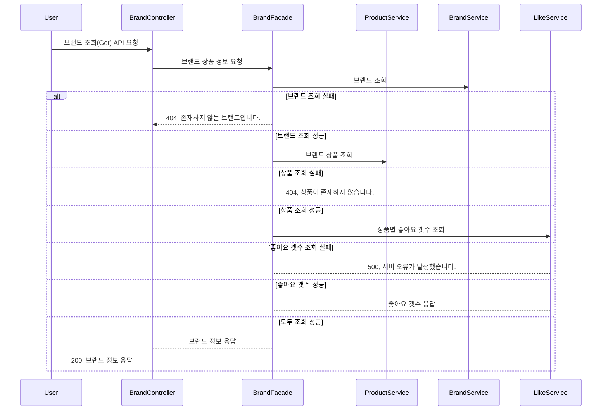
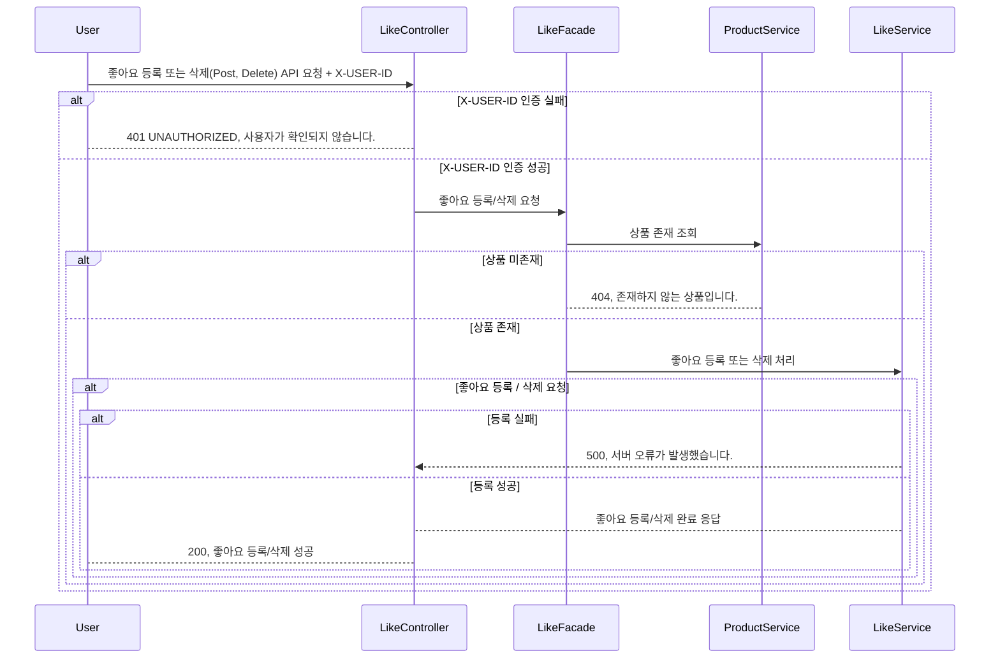
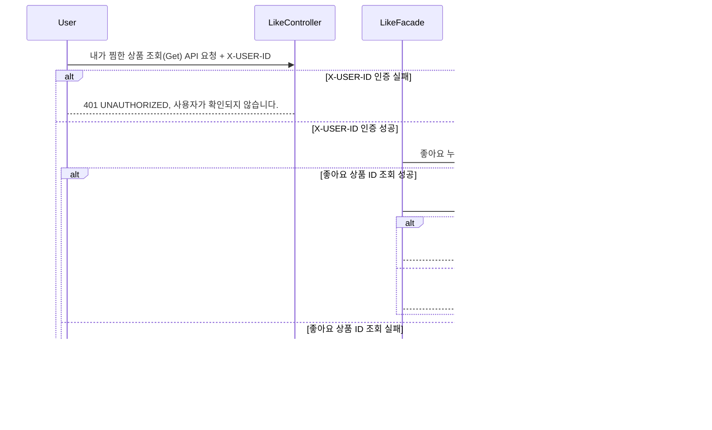
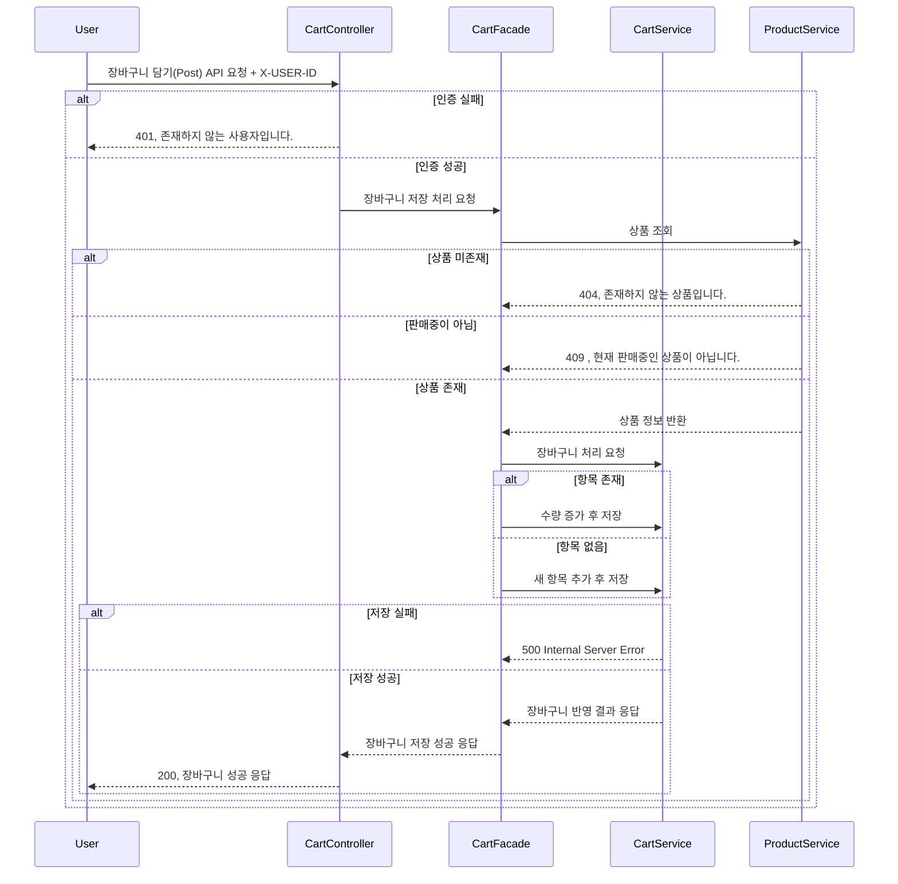
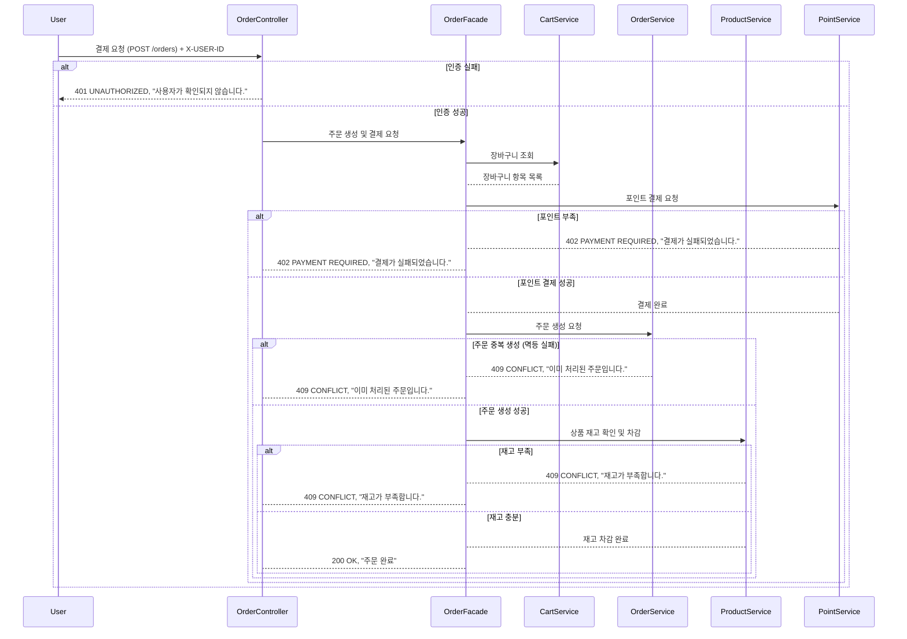
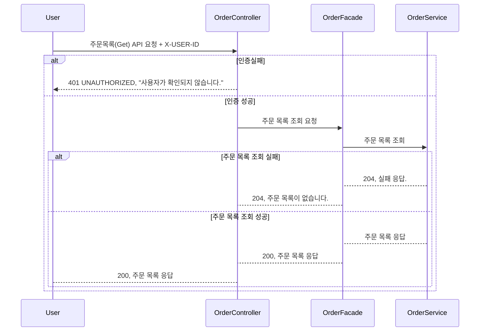
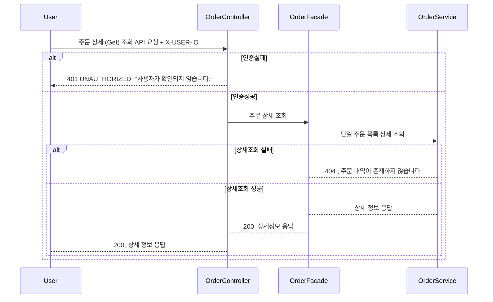

### 1. 목록 조회 

```mermaid
sequenceDiagram
    participant U as User
    participant PC as ProductController
    participant PF as ProductFacade
    participant PS as ProductService 
    participant BS as BrandService
    participant LS as LikeService

    U ->> PC : 상품 조회 (GET) API 요청
    PC ->> PF : 상품 목록 조회 요청
    PF ->> PS : 각 상품 정보 조회

    alt 조회 실패
        PF -->> PC : 404, 상품 조회 실패
    else 조회 성공
        PF ->> BS : 브랜드 정보 조회
        PF ->> LS : 좋아요 갯수 조회

        alt 브랜드 조회 실패
            BS -->> PF : 404, 존재하지 않는 브랜드입니다.
        else 브랜드 조회 성공
            BS -->> PF : 브랜드 매핑 응답
        else 좋아요 갯수 조회 실패
            LS -->> PF : 500, 서버 오류가 발생했습니다.
        else 좋아요 갯수 조회 성공
            LS -->> PF : 좋아요 갯수 응답
        else 모두 조회 성공
            PF -->> PC : 상품 목록 응답
            PC -->> U : 200, 상품 목록 응답
        end
            
    end
```

### 2. 상품 상세 정보

```mermaid
sequenceDiagram
    participant U as User
    participant PC as ProductController
    participant PF as ProductFacade
    participant PS as ProductService
    participant BS as BrandService
    participant LS as LikeService
    
    U ->> PC : 상품 상세 정보 (GET) API 요청
    PC ->> PF : 상품 상세 정보 요청
    PF ->> PS : 상품 존재 여부 확인 요청
    
    alt 상품 없음
        PF -->> PC : 404, 해당 상품을 찾을 수 없습니다.
    else 상품 있음
        PF ->> PS : 상품 상세 데이터 요청
        PF ->> BS : 브랜드 조회 요청
        PF ->> LS : 좋아여 여부 요청
        
        alt 브랜드 조회 실패
            BS -->> PF : 500, 상품 정보가 불안전합니다.
        else 브랜드 조회 성공
            BS --> PF : 브랜드 매핑 응답
        else 좋아요 여부 조회 실패
            LS --> PF : 400, 상품 정보가 불안전합니다.
        else 좋아요 여부 조회 성공
            LS --> PF : 좋아요 여부 응답
        else 모두 조회 성공
            PF --> PC : 상품 상세 정보 응답
            PC --> U : 200, 상품 상세 정보 응답
        end
    end
    
```

### 3. 브랜드 조회 

```mermaid
sequenceDiagram
    participant U as User
    participant BC as BrandController
    participant BF as BrandFacade
    participant PS as ProductService
    participant BS as BrandService
    participant LS as LikeService
    
    U ->> BC : 브랜드 조회(Get) API 요청
    BC ->> BF : 브랜드 상품 정보 요청
    BF ->> BS : 브랜드 조회
    
    alt 브랜드 조회 실패
        BF -->> BC : 404, 존재하지 않는 브랜드입니다.
    else 브랜드 조회 성공
        BF ->> PS : 브랜드 상품 조회
    else 상품 조회 실패
        PS --> BF : 404, 상품이 존재하지 않습니다.
    else 상품 조회 성공
        BF ->> LS : 상품별 좋아요 갯수 조회
    else 좋아요 갯수 조회 실패
        LS --> BF : 500, 서버 오류가 발생했습니다.
    else 좋아요 갯수 성공
        LS --> BF : 좋아요 갯수 응답
    else 모두 조회 성공
        BF --> BC : 브랜드 정보 응답
        BC --> U : 200, 브랜드 정보 응답
    end
```

### 4. 좋아요 등록  / 삭제

```mermaid
sequenceDiagram
    participant U as User
    participant LC as LikeController
    participant LF as LikeFacade
    participant PS as ProductService
    participant LS as LikeService

    U ->> LC : 좋아요 등록 또는 삭제(Post, Delete) API 요청 + X-USER-ID
    
    alt X-USER-ID 인증 실패
        LC --> U : 401 UNAUTHORIZED, 사용자가 확인되지 않습니다.
    else X-USER-ID 인증 성공
        LC ->> LF : 좋아요 등록/삭제 요청
        LF ->> PS : 상품 존재 조회
        alt 상품 미존재
            PS --> LF : 404, 존재하지 않는 상품입니다.
        else 상품 존재
            LF ->> LS : 좋아요 등록 또는 삭제 처리
            alt 좋아요 등록 / 삭제 요청
                alt 등록 실패
                    LS -->> LC : 500, 서버 오류가 발생했습니다.
                else 등록 성공
                    LS --> LC : 좋아요 등록/삭제 완료 응답
                    LC --> U : 200, 좋아요 등록/삭제 성공
                end
            end    
        end 
    end

    
   
```

### 5. 내가 찜한 상품 보기

```mermaid
sequenceDiagram
    participant U as User
    participant LC as LikeController
    participant LF as LikeFacade
    participant LS as LikeService
    participant PS as ProductService
    
    U ->> LC : 내가 찜한 상품 조회(Get) API 요청 + X-USER-ID
    
    alt X-USER-ID 인증 실패
        LC --> U : 401 UNAUTHORIZED, 사용자가 확인되지 않습니다.
    else X-USER-ID 인증 성공
        LF ->> LS : 좋아요 누른 상품 ID 조회
        alt 좋아요 상품 ID 조회 성공
            LF ->> PS : 상품 정보 조회
            alt 상품 정보 조회 성공
                PS --> LF : 상품 정보 응답
            else 상품 정보 조회 실패
                PS --> LF : 404, 존재하지 않는 상품입니다.
            end
        else 좋아요 상품 ID 조회 실패
            LF --> U : 404, 존재하지 않는 상품입니다.
        end  
    end


    
    
    
```

### 6. 장바구니 등록

```mermaid

sequenceDiagram

	participant U as User
	participant CC as CartController
	participant CF as CartFacade
	participant CS as CartService
	participant PS as ProductService

	
	U ->> CC: 장바구니 담기(Post) API 요청 + X-USER-ID

	alt 인증 실패 
		CC -->> U: 401, 존재하지 않는 사용자입니다.
	else 인증 성공
	    CC ->> CF : 장바구니 저장 처리 요청
	    CF ->> PS : 상품 조회
		alt 상품 미존재
			PS -->> CF: 404, 존재하지 않는 상품입니다.
		else 판매중이 아님
			PS -->> CF: 409 , 현재 판매중인 상품이 아닙니다.
		else 상품 존재
			PS -->> CF: 상품 정보 반환
			CF ->> CS: 장바구니 처리 요청
			alt 항목 존재
				CF ->> CS: 수량 증가 후 저장
			else 항목 없음
				CF ->> CS: 새 항목 추가 후 저장
			end
			alt 저장 실패 
				CS -->> CF: 500 Internal Server Error
			else 저장 성공
				CS -->> CF: 장바구니 반영 결과 응답
				CF -->> CC : 장바구니 저장 성공 응답
				CC -->> U : 200, 장바구니 성공 응답
			end
		end
	end

```

### 7. 주문 요청

```mermaid
sequenceDiagram
    participant U as User
    participant OC as OrderController
    participant OF as OrderFacade
    participant CS as CartService
    participant OS as OrderService
    participant PS as ProductService
    participant POS as PointService

    U ->> OC : 결제 요청 (POST /orders) + X-USER-ID

    alt 인증 실패
        OC -->> U : 401 UNAUTHORIZED, "사용자가 확인되지 않습니다."
    else 인증 성공
        OC ->> OF : 주문 생성 및 결제 요청

        OF ->> CS : 장바구니 조회
        CS --> OF : 장바구니 항목 목록

        OF ->> POS : 포인트 결제 요청
        alt 포인트 부족
            POS --> OF : 402 PAYMENT REQUIRED, "결제가 실패되었습니다."
            OF --> OC : 402 PAYMENT REQUIRED, "결제가 실패되었습니다."
        else 포인트 결제 성공
            POS --> OF : 결제 완료

            OF ->> OS : 주문 생성 요청
            alt 주문 중복 생성 (멱등 실패)
                OS --> OF : 409 CONFLICT, "이미 처리된 주문입니다."
                OF --> OC : 409 CONFLICT, "이미 처리된 주문입니다."
            else 주문 생성 성공
                OF ->> PS : 상품 재고 확인 및 차감

                alt 재고 부족
                    PS --> OF : 409 CONFLICT, "재고가 부족합니다."
                %% 여기서 포인트 롤백??도 넣어야될지?,,
                    OF --> OC : 409 CONFLICT, "재고가 부족합니다."
                else 재고 충분
                    PS --> OF : 재고 차감 완료
                    OF --> OC : 200 OK, "주문 완료"
                end
            end
        end
    end
    
```
### 8. 유저의 주문 목록 조회

```mermaid
sequenceDiagram
    participant U as User
    participant OC as OrderController
    participant OF as OrderFacade
    participant OS as OrderService
    
    U ->> OC : 주문목록(Get) API 요청 + X-USER-ID
    
    alt 인증실패
        OC -->> U : 401 UNAUTHORIZED, "사용자가 확인되지 않습니다."
    else 인증 성공
        OC ->> OF : 주문 목록 조회 요청
        OF ->> OS : 주문 목록 조회
        alt 주문 목록 조회 실패
            OS --> OF : 204, 실패 응답.
            OF --> OC : 204, 주문 목록이 없습니다.
        else 주문 목록 조회 성공
            OS --> OF : 주문 목록 응답
            OF --> OC : 200, 주문 목록 응답
            OC --> U :  200, 주문 목록 응답
        end
    end
    
```

### 9. 단일 주문 목록 상세 조회

```mermaid
sequenceDiagram 
    participant U as User
    participant OC as OrderController
    participant OF as OrderFacade
    participant OS as OrderService
    
    U ->> OC : 주문 상세 (Get) 조회 API 요청 + X-USER-ID

    alt 인증실패
        OC -->> U : 401 UNAUTHORIZED, "사용자가 확인되지 않습니다."
    else 인증성공
        OC ->> OF : 주문 상세 조회
        OF ->> OS : 단일 주문 목록 상세 조회
        alt 상세조회 실패
         OS --> OF : 404 , 주문 내역이 존재하지 않습니다.
        else 상세조회 성공
         OS --> OF : 상세 정보 응답
         OF --> OC : 200, 상세정보 응답
         OC --> U : 200, 상세 정보 응답
        end 
    end    
    
    
```

