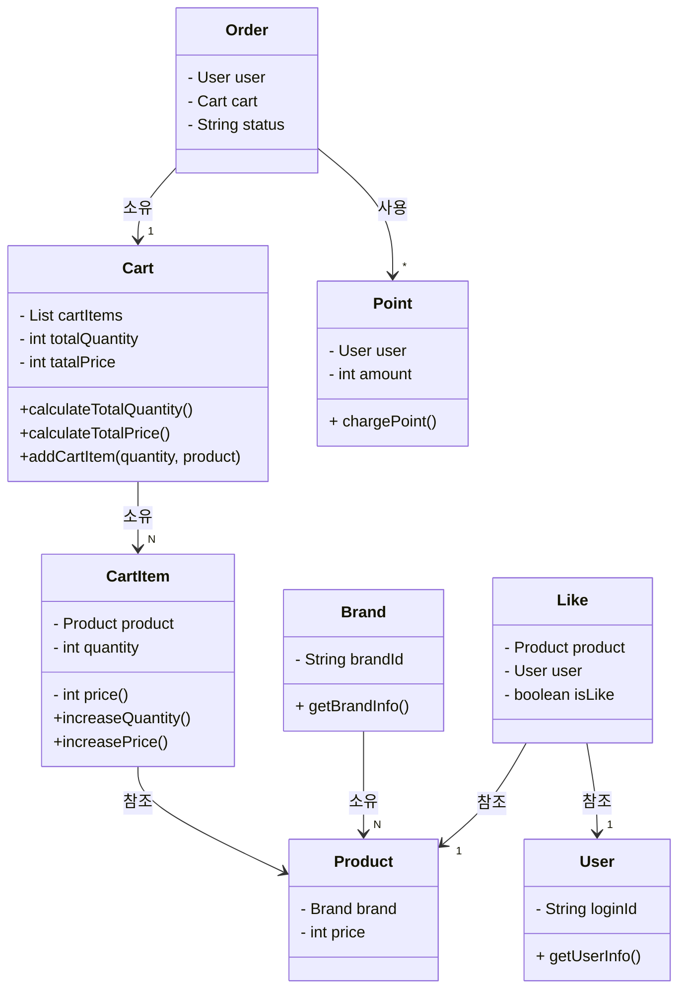

```mermaid
classDiagram
    Cart --> "N" CartItem : 소유
    CartItem --> Product : 참조
    Order --> "1" Cart : 소유
    Order --> "*" Point : 사용
    Brand --> "N" Product : 소유
    Like --> "1" Product : 참조
    Like --> "1" User : 참조
    
 class User{
        - String loginId
        
        + getUserInfo()
 }
 
 class Brand{
     - String brandId
     
     + getBrandInfo()
 }
 
 class Order {
     - User user
     - Cart cart
     - String status
 }
 
 class Cart{
     - List<CartItem> cartItems
     - int totalQuantity
     - int tatalPrice
     
     +calculateTotalQuantity()
     +calculateTotalPrice()
     +addCartItem(quantity, product)
 }
 
 class CartItem {
     - Product product
     - int quantity
     - int price()

     +increaseQuantity()
     +increasePrice()
 }
 
 class Product {
     - Brand brand
     - int price
 }
 
 class Like {
     - Product product
     - User user
     - boolean isLike
 }
 
 class Point {
     - User user
     - int amount
     
     + chargePoint()
 }
```