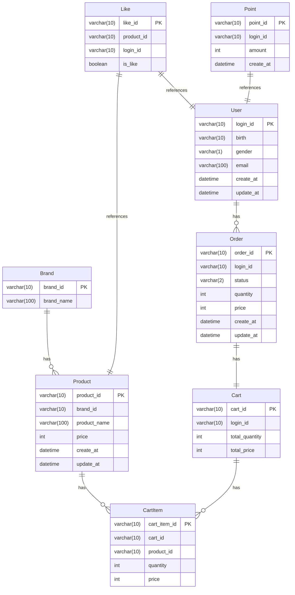

```mermaid
erDiagram
    
    User {
        varchar(10) login_id PK
        varchar(10) birth 
        varchar(1) gender 
        varchar(100) email
        datetime create_at
        datetime update_at
    }
    
    Brand {
        varchar(10) brand_id PK
        varchar(100) brand_name 
    }
    
    Product {
        varchar(10) product_id PK
        varchar(10) brand_id 
        varchar(100) product_name
        int price
        datetime create_at
        datetime update_at
    }
    
    Order {
        varchar(10) order_id PK
        varchar(10) login_id 
        varchar(2) status
        int quantity
        int price
        datetime create_at
        datetime update_at
    }
    
    Cart {
        varchar(10) cart_id PK
        varchar(10) login_id 
        int total_quantity
        int total_price
    }
    
    CartItem {
        varchar(10) cart_item_id PK
        varchar(10) cart_id 
        varchar(10) product_id
        int quantity
        int price
    }
    
    Like {
        varchar(10) like_id PK
        varchar(10) product_id 
        varchar(10) login_id
        boolean is_like
    }
    
    Point{
        varchar(10) point_id PK
        varchar(10) login_id
        int amount 
        datetime create_at
    }
    
    
    Brand ||--o{ Product : has
    User ||--o{ Order : has
    Cart ||--o{ CartItem : has
    Order ||--|| Cart : has
    Product ||--o{ CartItem : has
    Like ||--|| Product : references
    Like ||--|| User : references
    Point ||--|| User : references
    
```